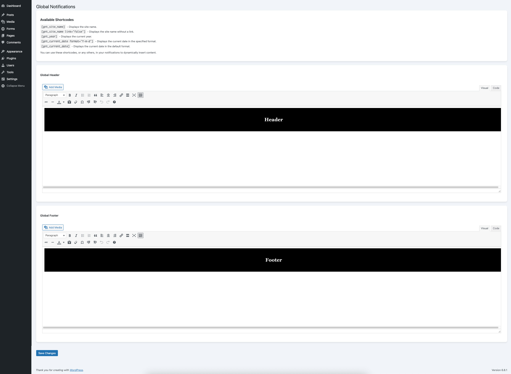
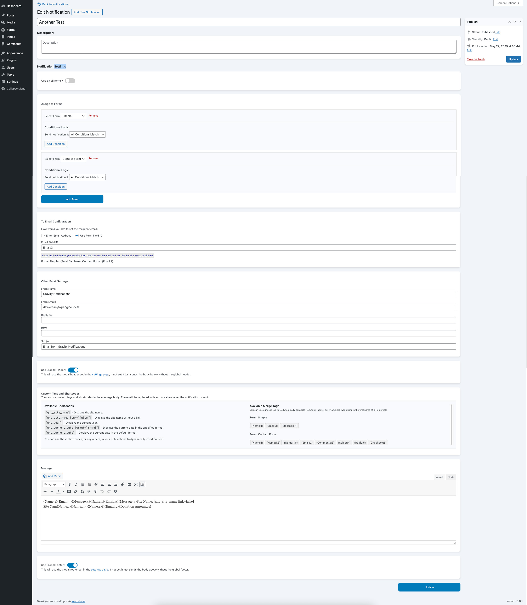

# Gravity Notifications

Mangage notifications for Gravity Forms in one place so can assign to multiple forms.

## Requirements

- php 8.0
- WordPress 6.8
- Gravity Forms (tested with v 2.9.8)

## Usage

1. Upload the zip file to your WordPress plugins folder
2. Activate plugin and add license within the plugin screen
3. Configure max width, global header and footer in Forms >Notifcation Settings in the admin screen
4. Configure each notification within Forms > Notifications

## Screenshots
#### Global Edit Screen

#### Notification Edit Screen

## FAQ

Do I have to have a license to test?

No, if you are using a local testing machine, we have included functionality to enable all settings, then once you go live you will need to add your license

Does this override the core Gravity Forms notifications?

No, these notifications will send as normal, so deactivate or delete the notifications you do not wish to send

Can I use conditional logic for wich email to send the notification to?

No, At this stage these notifications do not support email routing like the default Gravity Forms notifications.

What does Set a Max Width do?

If you turn this setting on and then set the width, it will wrap your entire email in a table with the max width and certrally aligned. 
This is specifically useful for ensuring displays on mobiles without overflow;

Do I have to use the global header and footer?

No, they are merely there so you do not need to add them across all notifications. If you enable the Global Header on a notification, it concatenates it to the message as part of the body, same with the footer.

How can I test the notification works?

You will need to submit the relevant form, I suggest adding a plugin to disable emails and also to log emails.
 
I use and recommend plugins by webaware:
 
[Disable Emails](https://wordpress.org/plugins/disable-emails/)
 
[Log Emails](https://wordpress.org/plugins/log-emails/)

Can I use shortcodes in notifications?

Yes, you can use any shortcode in the Gloabl Notifications (header and footer) and the Notification Message.
 
We have included a few shortcodes to assist, like site name, year and date. These will appear in any of the WYSIWYG editors for your reference.

Can I use field values in notifications?

Yes, you can use form fields (merge tags) in the To Email and and also the Message, but not in header or footer of Global Notifications.
 
There are buttons above the message that shows you the fields in all assigned forms that you can use. Use common fields so that they appear on all emails.
 
Alternatively, when you edit a field in the Gravity Form, in the top right you will see the Field ID (in a grey pill shaped element).
 
Then your merge tag will generally be label:id, so if you have an email field with label Email and an ID of 2, then the merge tag is Email:2.
 
If you have a field which is actually a group of fields, like Name or Address, then the value may be different.
 
For example, if you have a Name field with an ID of 1, then the fields would be more like:
 
| Field | Tag ID | Merge Tag |
| ------------- | ------------- | ------------- |
| Prefix | 1.1 | Name:1.1 |
| First | 1.2 | Name:1.2 |
| Middle |1.3 | Name:1.3 |
| Suffix | 1.4 | Name:1.4 |

### Changelog
**1.5.0** Update 
* Added max width settings and renamed Global Notifications to Notification Settings

**1.4.0** Update 
* Updated styles
* Added Header and Footer previews to messages

**1.3.0** Update 
* Added merge tags as buttons for assigned forms
* Added shortcode support and custom shortcodes

**1.2.0** Update 
* Added merge tag support to message

**1.1.0** Update 
* Added Licensing